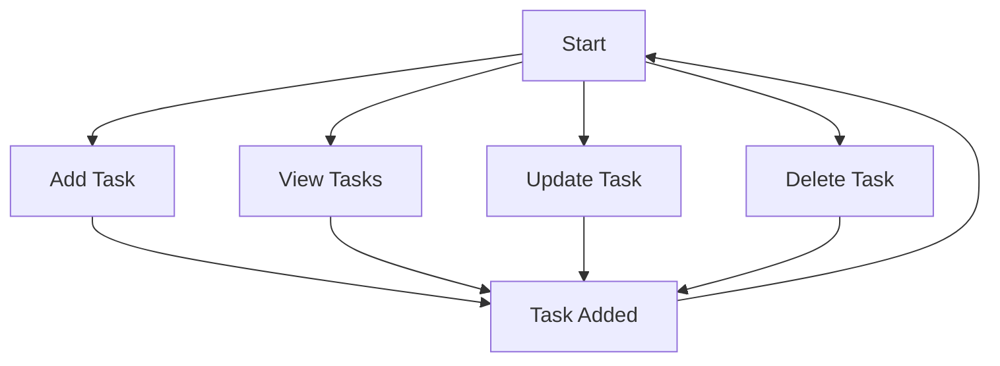

# To-Do App

## Overview
The To-Do App is a Flask-based application designed to help users manage their tasks efficiently. It allows users to add, view, update, and delete tasks, providing a streamlined way to organize daily activities.

## Features
- Add new tasks
- View all tasks
- Update existing tasks
- Delete tasks
- Mark tasks as completed

## App Flow


## Requirements
- Python 3.x
- Flask
- Flask-SQLAlchemy

## How to Run
1. Clone the repository.
2. Navigate to the `to-do app` directory.
3. Install the required dependencies using the command:
   ```
   pip install -r requirements.txt
   ```
4. Run the Flask application using the command:
   ```
   python app.py
   ```

## Future Enhancements
- Add a graphical user interface (GUI).
- Integrate with a persistent database.
- Add user authentication for personalized task management.python app.py